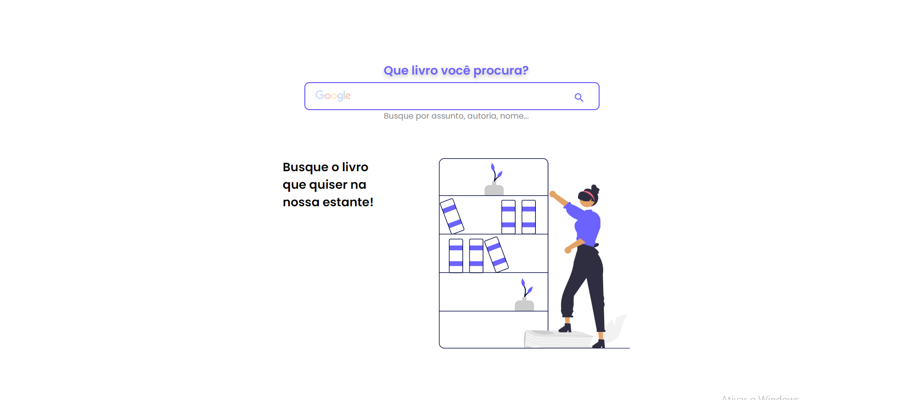
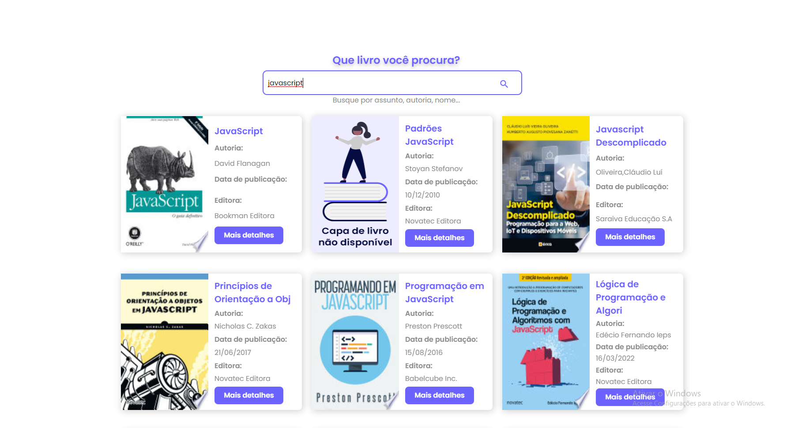
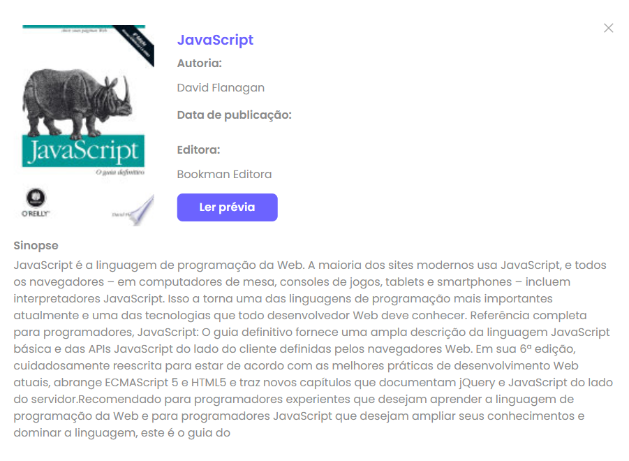

# Projeto Buscante


O projeto buscante é um site que você pode buscar qualquer livro do mundo, apenas digite o tema ou nome do livro no campo de busca e uma lista de livros serão exibidos.

## 📌Índice 
- <a href="#tecnologias-utilizadas">Tecnologias utilizadas</a>
- <a href="#proposito">Propósito</a>
- <a href="#funcionalidades-do-projeto">Funcionalidades do Projeto</a>
- <a href="#layout">Layout</a>
- <a href="#projeto">Projeto</a>
- <a href="#como-rodar-o-projeto">Como rodar o projeto</a>
- <a href="#autores">Autores</a>

## 📱Tecnologias utilizadas
1. [Angular](https://angular.io/cli)
2. [Google Books Api](https://developers.google.com/books?hl=pt-br)

## 🎯Propósito
O propósito deste projeto em Angular é me aprodundar em consumo de API's no framework Angular. Foi um projeto acadêmico criado em colaboração com a Alura, com o objetivo de explorar e dominar os conceitos de consumir,tratar e exibir dados de uma API no Angular.

Durante o projeto, adquiri conhecimentos essenciais sobre Angular, como diretivas, injeção de dependências e manipulação de requisições HTTP. Aprendi o padrão Observer e a usar Observables para criar fluxos de dados reativos. Habilitei o debug do fluxo, manipulei dados do backend e otimizei a busca typeahead. Também aprendi a lidar com erros usando catchError e throwError. Essas habilidades fortaleceram meu conhecimento no Angular.

Este projeto foi uma oportunidade valiosa para aprimorar minhas habilidades no desenvolvimento Angular e obter uma compreensão aprofundada como tratar,consumir e exibir dados de uma API.

## 🖥Funcionalidades do Projeto

✔ Campo de busca, pode pesquisar qualquer livro.<br>
✔ Todos os dados dos livros são exibidos através da API do Google.<br>
✔ Os livros vem com nome do livro, autoria, data de publicação e editora.<br>
✔ Ler a prévia dos livros.

## 🧩Layout





## 🎮Projeto
➡  [link do projeto](https://buscante-psi.vercel.app/lista-livros) ⬅

## ⚠Como Rodar o Projeto
```bash
# Clone este repositório
$ git clone https://github.com/Jonas-Sousa/buscante.git

# Acesse a pasta do projeto no seu terminal
$ cd buscante

# Instale as dependências
$ npm install

# Execute a aplicação
$ ng serve
```
## 😎Autores 

  <br>
  <p>Jonas Sousa</p>
  
  
  [Linkedin](https://www.linkedin.com/in/jonas-sousa-dev/)


